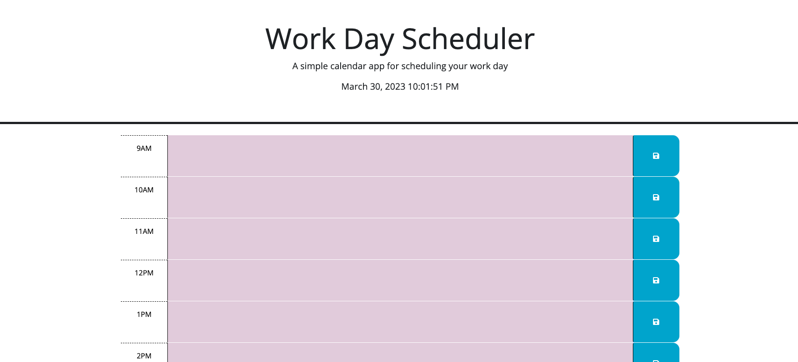

# daily-planner

## Description

I started this project with the intention of creating an easy way to keep track of my time and what I need to do each day. This project allows you to save your hourly tasks for a single day so that you can better organize your schedule. Throughout this project, I learned how to use third-party Web APIs such as jQuery, Bootstrap, and DayJS. 

## Usage

[This is the link to the completed application](https://erothman1.github.io/daily-planner/)

This is a screenshot to the completed application:

## How to Contribute

For information on how to contribute to this project, please email me at elva.rothman.developer@gmail.com!

